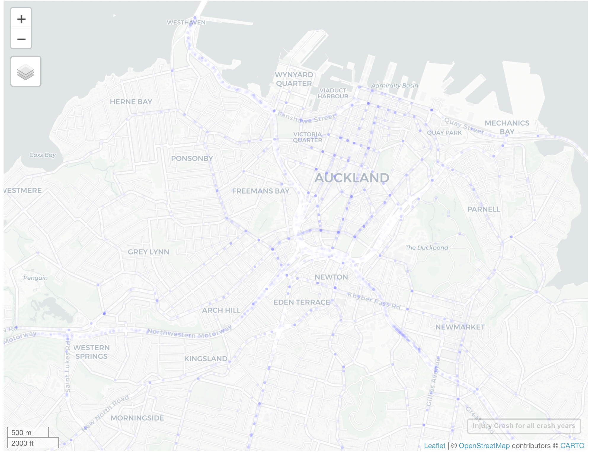
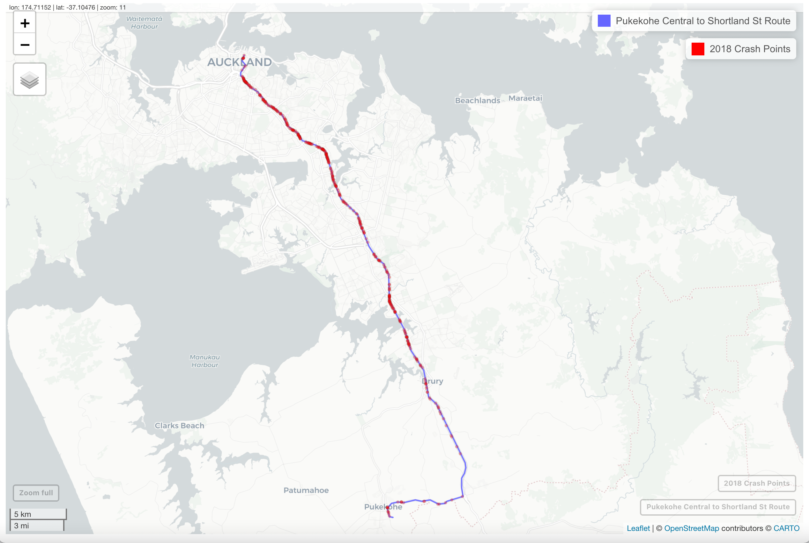
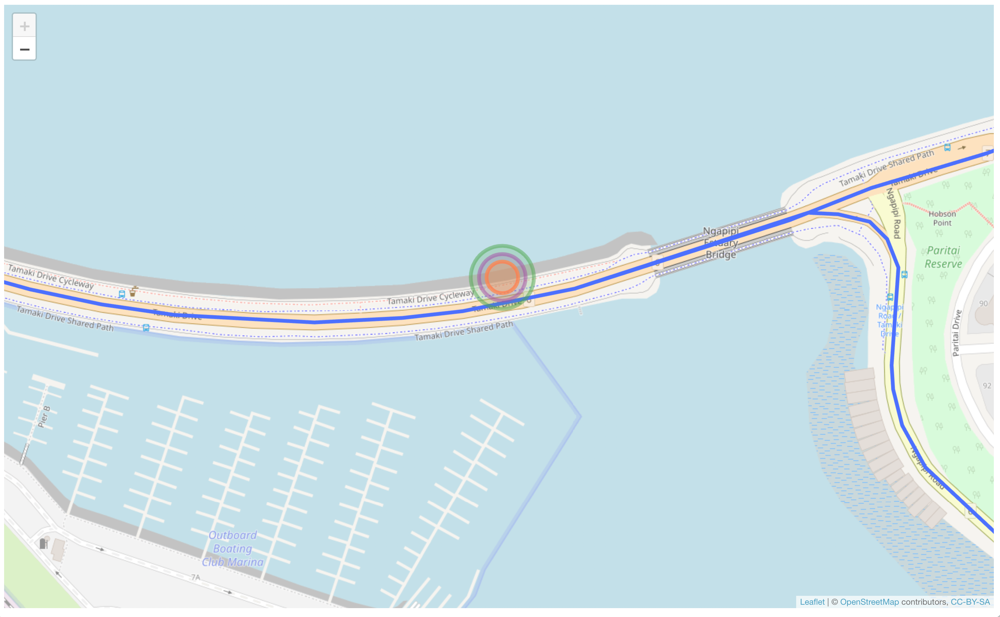

# Abstract

Abstract should contain a brief summary of the aim, methodologies, finds and conclusions of the disseration. That abstract should normally be fewer than 350 words.

# Acknowledgement

# 1 Introduction

The purpose is to describe the general subject area, state the research problem of interest, outline the main results of the thesis, and put the results in context with wider subject area and its applications.

The main body of the text must be divided into a logical scheme which is followed consistently throughout the work. It usually starts with an introduction chapter and ends with a conclusion.

## inspiration of this project

<https://saferactive.github.io/trafficalmr/articles/report1.html>

SaferActive project is the inspiration for this research. The SaferActive project is funded by the United Kingdom (UK) Department for Transport in support of aims to outlined in the cycling and walking investment strategy (CWIS): to double the number of stages cycled compared with the baseline year of 2013, and "reverse the decline in walking)" whilst reducing the casualty rate per km walked and cycled year on year.

The methods of estimating safety in the more commonly used units of killed and seriously injured per billion km (KSI/bkm), and outline progress in collecting, analysing and modelling datasets that will be used in subsequent steps of the project.

April 2020 is the inception of the project. They were able to develop a new R package, trafficalmr, to automate the access and analysis of exposure data, casualty data and intervention data.

Collected and preprocessed data from a wide range of source to support next steps in the project.

Explored various geographic, interactive and static visualisation options, including who-hit-who visualisations using 'upset plots'

Analysed the variability of estimated walking and cycling risk per bkm (section 8)

Crreated a prototype web app to visualise road safety data as basis for considering next steps.

## 1.1 Motivation

we wanted to create an R Package so that we calcu

## 1.2 Problem Statement

-   The research problem is clearly and concisely **defined** (e.g. as research questions).

-   The research is clearly **motivated**, i.e. its importance is explained

-   The **scope** of the research done in the project is clearly stated.

## 1.3 Research Objectives

Overall Aim/Goal of the Project - MoT are looking to adapt trafficalmr - Adding value to road safety policies that can help the lives of New Zealanders - Better safety outcomes for active transport modes - this project will set the data foundations for adapting trafficalmr to the New Zealand context and enable policy/traffic calming intervention analyses. - The main part of the work will involve data processing. But the variety of the data will keep the work interesting - the work involves geospatial datasets (raw and derived), APIs (Cyclestreets, OpenStreetMap) and census datasets - The policy analysis will use the developed data foundations to estimate the casualty rate per billion kilometres for walking and cycling to work commutes - Data visualisation and data communication will be an ideal closing point for this project.

trafficalmr open source project (in R) - an initiative from the UK that seeks to automate and analyse: risk exposure, traffic casualty and intervention indicators to better understand road safety outcomes in the UK.

## 1.4 Contributions

## 1.5 Overview of Approach

## 1.6 Scope & Structure

-   The scope of the research is

for commuters that are travelling from their usual residence to work

# 2 Related Work

-   An appropriate number and range of related works is cited ( \>= 20 for dissertation)

-   Related work is appropriately organised (e.g. using subsections or tables)

-   Important concepts and contributions of related work are explained

-   Related work is discussed in relation to the research problem and proposed solution

-   Gaps in the knowledge about the research problem are identified to explain the novelty of the research in the report.

++++++++++++++++++++++++++++++++++++++++++++++++++++

Wanted to set the scene on the relevance of road safety, how New Zealand's road safety measure compared to other countries.

## 2.1 Road Safety

## 2.2 Policies on Road Safety

-   Currently Road Safety Policies in new zealand

## 2.3 Exposure

## 2.4 Risk

-   compare why some methodologies are using time travelled vs distance travelled. Why are we using distance travelled in this project

## 2.5 Geocomputation/Spatial Analysis

-   what is geocomputation or Spatial Data Analysis

## 2.6 Hotspot Analysis

-   KDE
-   Autocorrelation

## 2.7 Trafficalmr

## 2.8 Summary

# 4 Experimental Design

## 4.1 Implementation

### 

## 4.2 Validating Route Simulation

-   Validating the the routes

## 4.3 Datasets and Processing the Data (Dataset Analysis)

```{r include=FALSE}

#Set options for the entire document in the first chunk.

knitr::opts_chunk$set(echo = FALSE, warning = FALSE, include = FALSE)
```

```{r, echo=FALSE, warning = FALSE}
# libraries required

library(sf)
library(ghroute)
router(osm.file = "osm/new-zealand-latest.osm.pbf")
library(leaflet)
library(mapview)
library(readxl)
library(dplyr)
library(ggplot2)
library(tmap)
library(grid) # display side by side plot

```

```{r}

# Datasets from the package

jtw_driving_akl <- readRDS("data/jtw_driving_akl.rds")
sa2_clipped_geo_akl <- readRDS("data/sa2_clipped_geo_akl.rds")

```

```{r}

## SA2 to MB mapping provided by StatsNZ
#key <- read_xlsx("../data/Stats NZ Geographic Key.xlsx", 
 #          sheet = "Geographic Key")

#saveRDS(key, "data/key.rds")

key <- readRDS("data/key.rds")

## need to change data type of MBs so we can join it with df
key$MB2018_V1_00 <- as.character(key$MB2018_V1_00)

## correcting Territorial auth desc name
names(key)[8] <- "Territorial_auth_desc"

## grouping by SA2 and territorial auth district to remove duplicates
key_2 <- key[, c(3,8)] %>% 
  group_by(`Statistical area 2 code (2018 areas)`, Territorial_auth_desc) %>% 
  summarise(n = n()) %>% 
  mutate(`Statistical area 2 code (2018 areas)` = 
           as.integer(`Statistical area 2 code (2018 areas)`))

```

### a. Journey to work data

The 2018 census main means of travel to work data is used to derive the journey made by drivers who are 15 years old and over from their usual residence to their place of work through the 2018 census. Data for this study included every unique journey made by a driver of a car, truck or van, either private or company to estimate the commuter's road safety exposure through the distance it has driven. The usual residence and workplace locations are the centroids of 2018 Statistical Area 2 New Zealand geographic boundaries (SA2) [1]. Auckland Transport has also used this dataset, the organisation responsible for all transport services in the Auckland region, to understand travel patterns. The key findings from their analysis are increasing public transport uptake, increasing walking and cycling in the Central areas and driving being the primary mode of transport to work, especially in the outer urban area [2].

This study focuses on drivers whose usual residence is in the Auckland region (41% of trips, n = 16,035). In figure 1, notice that the usual residence spatial polygons are dispersed in the Auckland region. At the same time, the workplace is concentrated in specific areas such as Penrose, Auckland Airport, Middlemore, Takapuna Central and Parnell West. This means that drivers typically drive from various areas in Auckland to particular areas for their workplace. The centroids of the SA2 units represent the coordinates of both the usual residence and workplace used to estimate the total distance traveled for each unique trip using the ghroute package.

The outliers (journey from usual residence to the workplace is greater than or equal to 600 km; 0.01% of all the drivers or 0.02% of all unique car trips) in the dataset is excluded from the analysis. A total of 16,031 trips were made by 293,382 drivers whose usual residence is in Auckland Region.

```{r, echo = FALSE, warning = FALSE}

# insert usual residence vs usual workplace plot side by side

# tidying up values
jtw_driving_akl[jtw_driving_akl == -999] <- 0

jtw_driving_akl$total_driving_travellers <-  jtw_driving_akl$Drive_a_company_car_truck_or_van +
  jtw_driving_akl$Drive_a_private_car_truck_or_van

#sum(jtw_driving_akl$total_driving_travellers)
#class(sa2_clipped_geo_akl)

# usual residence
sa2_usual_res_driving <- sa2_clipped_geo_akl[c("SA22021_V1", "SA22021__1",  "geometry")] %>% 
  mutate(SA22021_V1 = as.integer(SA22021_V1)) %>% 
  right_join(jtw_driving_akl[c("SA2_code_usual_residence_address", "total_driving_travellers")], by = c("SA22021_V1" = "SA2_code_usual_residence_address")) %>% 
  group_by(SA22021_V1, SA22021__1) %>% 
  summarise(`Total Driving` = sum(total_driving_travellers))

# usual workplace
sa2_work_driving <- sa2_clipped_geo_akl[c("SA22021_V1", "SA22021__1",  "geometry")] %>% 
  mutate(SA22021_V1 = as.integer(SA22021_V1)) %>% 
  right_join(jtw_driving_akl[c("SA2_code_workplace_address", "total_driving_travellers")], by = c("SA22021_V1" = "SA2_code_workplace_address")) %>% 
  group_by(SA22021_V1, SA22021__1) %>% 
  summarise(`Total Driving` = sum(total_driving_travellers)) 
 
## plotting sa2_usual_res_driving
p1 <- tm_shape(sa2_usual_res_driving) +
  tm_polygons(col = "Total Driving", lwd = 0.0001) +
    tm_layout(panel.labels = c("Auckland, NZ Usual Residence (2018)")) #, panel.label.size = 0.5)


## plotting sa2_usual_res_driving
p2 <- tm_shape(sa2_work_driving) +
  tm_polygons(col = "Total Driving", lwd = 0.0001) +
  tm_layout(panel.labels = c("Auckland, NZ Workplace (2018)")) #, panel.label.size = 0.5) 

  
######


#plotting usual residence
#qtm(sa2_usual_res_driving, c("Total Driving")) + 
 # tm_layout(panel.labels = c("Auckland, NZ Usual Residence (2018)"), 
  #          panel.label.size = 0.5) 

  

#plotting usual workplace
#qtm(sa2_work_driving, c("Total Driving")) + 
 # tm_layout(panel.labels = c("Auckland, NZ Usual Residence (2018)"),
  #          panel.label.size = 0.5) 

  
#sum(jtw_driving_akl$total_driving_travellers )
#sum(sa2_usual_res_driving$total_driving_travellers)
#sum(sa2_work_driving$total_driving_travellers)


```

```{r res_vs_work, echo = FALSE, warning = FALSE,fig.cap = "Comparing Statistica Area 2" }
tmap_arrange(p1, p2, nrow = 1)

```

```{r figs1, echo = FALSE, warning = FALSE, fig.align = "middle", fig.width=7,fig.height=6,fig.cap="\\label{fig:figs1}Figure: Usual Residence vs Workpalce "}

#grid.newpage()
#pushViewport(viewport(layout=grid.layout(1,2)))
#print(p1, vp=viewport(layout.pos.col = 1), asp =  1:5)
#print(p2, vp=viewport(layout.pos.col = 2), asp =  2:5)


```

in Figure \ref{fig:figs1} we see examples of plotting in R.

In Figure 1, notice that the usual residence (left plot) plot has the usual residence scattered across Auckland. However, the areas where the commuters work (right plot) the commuters are located in specific Statistical Area 2 areas, predominantly in Penrose, East Tamaki, North Harbour, Auckland Airport and Manukau Central.

++++++++++++++

(Notes from Simon) - find literature where this was used - dig out other implementations - where did u get it from, how was it collected - what is the methodology used to collect the data - what analysis statsnz has performed - defined what you want to do with the data - what are the high level goals with the data, construct or estimate the routes for all those commutes. Estimate the traffic on those routes that are due to commute. - estimate this with the crash sites - how dangerous are potential routes - going back to the sources or residence location, how dangerous are there commutes on particular locations (SA2 polygon usual residence)

### b. CAS data

The crash data is sourced from the Waka Kotahi Crash Analysis System (CAS), which records all road traffic crash reported to the New Zealand Police to analyse road safety risk. Various organisations use CAS data with the broad aim of improving road safety [3]. For example, the New Zealand government uses the CAS data to support the adoption of the 'Road to Zero' strategy. The vision of the said strategy is that no one is killed or seriously in road crashes and that there are no deaths or serious injuries while travelling on New Zealand roads. The data has also facilitated transportation policy, designing and prioritising road safety improvements and monitoring their effectiveness [4].

This study is interested in crashes that occurred in 2018 in alignment with the 2018 census main means to travel to work data where trips made by drivers occurred in 2018. According to Waka Kotahi, non-injury crashes are vastly underreported [3]; however, it is used in this study to analyse the risk exposure for each unique journey made by the driver. The projection coordinates in the CAS data are used to determine the specific location of the crash and were used to analyse if the crash has intersected with the journey made by the driver given a particular distance.

Figure 2 is a time series plot that shows the trend of the total number of crashes for each crash year by crash severity. As mentioned earlier, minor crashes and non-injury crashes are the predominant type of crashes reported in CAS data. From the plot, you can notice that around 2013, there was a dip in crashes and 2018, there was a peak of crashes reported for all crash severity.

Injury crashes typically occur at road junctions, as seen in figure 3. It is apparent that the road junctions have a high density of crashes. It is also noticeable in figure 3 that busy roads such as the North-western motorway and Southern motorway have high-density crashes; these are some insights that need to be considered in the road safety analysis.

```{r, echo = FALSE, warning = FALSE}

## CAS data
cas_data <- readRDS("data/Crash_Analysis_System_(CAS)_data.rds")

## create a new column called non_injury_crash
cas_data$non_injury_crash <- ifelse(cas_data$crashSeverity == 'Non-Injury Crash', 1, 0)

#table(cas_data$crashSeverity)

## total crashes
cas_data$total <- rowSums(cas_data[c("fatalCount", "minorInjuryCount", "seriousInjuryCount",  "non_injury_crash")], na.rm = TRUE)

cas_data_proj <- st_as_sf(cas_data, coords = c("X", "Y"), crs = 2193)

cas_data_geo <- st_transform(cas_data_proj, crs = 4326)


cas_data_akl_proj <- st_as_sf(cas_data[cas_data$region == 'Auckland Region',], coords = c("X", "Y"), crs = 2193)

cas_data_akl_geo <- st_transform(cas_data_akl_proj, crs = 4326)

##filtering the data to serious and fatal crashes in 2018 around the Auckland Region
cas_data_akl_2018_geo <-  cas_data_akl_geo[(cas_data_akl_geo$crashYear == 2018 & cas_data_akl_geo$region == "Auckland Region"), ]

#cas_data_akl_2018 <-  cas_data[(cas_data$crashSeverity %in% c("Serious Crash", "Fatal Crash")
#    & cas_data$crashYear == 2018 & cas_data$region == "Auckland Region"), ]


```

```{r echo = FALSE, warning = FALSE}
#insert crashes over time by type of crashes

cas_data_per_year <- cas_data %>% 
  group_by(crashYear, crashSeverity) %>% 
  summarise(Total = sum(total))

names(cas_data_per_year)[2] <- "Crash Severity"

```

```{r crash_year_fig, fig.cap = "Figure 1: Total Crashes per Year", fig.align = "middle"}

ggplot(cas_data_per_year, aes(x = crashYear, y = Total)) + 
  geom_line(aes(color = `Crash Severity`), size = 1) +
  #labs(title =" Total Crashes per year by Severity", x = "Crash Year", y = "Total Crashes")  +
  labs(x = "Crash Year", y = "Total Crashes")  +
  guides(colour = guide_legend(nrow = 1)) +
   theme(legend.title=element_blank(), legend.position="top", legend.text = element_text(size=8))


#  theme(legend.text = element_text(size=6))


```

*Figure 2: Time series plot of total number of crashes per year by crash severity*




*Figure 2. Red points are all non-injury crashes from 2018 to 2021.*

```{r}

#Plotting all crash points for all years and all crash severity except where crash severity is non-injury

#mapview(st_geometry(cas_data_akl_geo[cas_data_akl_geo$crashSeverity != "Non-Injury Crash", ]), 
#       alpha = 0,  
#      alpha.regions = 0.05, 
#       layer.name = "Injury Crash for all crash years",
#        cex = 2, col.region = "red") #change alpha from 0.1 to 0.05


```

### c. Statistical Area 2 Polygons

The statistical Area 2 clipped polygons are extracted from Statistics New Zealand. It is defined at mesh block and statistical area 1 level geographic units. The statistical area 2 geospatial data are updated over time due to changes in geographic boundaries [5]. In this research, we are using the 2018 statistical area 2 clipped to coastline version to suit the 2018 census main means of work data.

### d. Auckland Traffic Counter

The Auckland traffic counts dataset is sourced from Auckland Transport. The data is an approximate indication of traffic volumes across different sites in Auckland. The traffic volumes are counted at varying dates and times; for example, AM peak, Mid peak and PM peak, and weekday and weekend volumes. The traffic counts predominantly count both directions of traffic flow (99.68% of traffic counts in both directions of traffic). The data set also contains information on the coordinates of the exact location of the traffic counters, typically on the side of the road. This data has helped understand traffic volume to support road design, prioritising network improvements, assess road safety risk exposure and determine the effectiveness of past road improvements [6].

In this study, we used Auckland traffic counts that occurred in 2018 to validate the traffic volume obtained from the simulated routes against actual traffic volumes. As mentioned earlier, the traffic counter is placed on the side of the road. This means it will not intersect with any of the simulated routes. The width of the road varies depending on the type of road and the area; thus, these need to account for when associating the simulated routes with the traffic volumes from the traffic counter. We determined that the optimal distance between the route in either direction of the traffic flow and the location of the traffic counter is 20 meters. Around 30% of the traffic counters are not within a 20 meters radius from the commuter's routes. The main reason for this is that we are using centroids of the statistical area 2 geographic unit rather than the actual residence of the drivers; thus, there are routes that the driver does not traverse for this reason.

###e. Dataset Analysis references

Reference

[1] https://datafinder.stats.govt.nz/table/104720-2018-census-main-means-of-travel-to-work-by-statistical-area-2/
[2] https://at.govt.nz/about-us/reports-publications/2018-census/

[3] https://www.nzta.govt.nz/safety/partners/crash-analysis-system/

[4] https://www.transport.govt.nz/area-of-interest/safety/road-to-zero/

[5] https://catalogue.data.govt.nz/dataset/statistical-area-2-2018-clipped-generalised
[6] https://at.govt.nz/about-us/reports-publications/traffic-counts/ 


```{r}

#loading AT traffic counter data

#at_traffic_count <- 
#read_xlsx("../data/at-website-traffic-counts-2012-2021.xlsx", 
#           sheet = "July 2012 to May 2021",
#          skip = 1)

#at_traffic_count$year = format(at_traffic_count$`Count Start Date`, format = "%Y")

#saveRDS(at_traffic_count, "data/at_traffic_count.rds")

at_traffic_count <- readRDS("data/at_traffic_count.rds")

## we are only interested traffic at 2018
#at_traffic_count_2018 <- at_traffic_count[at_traffic_count$year == 2018 &
#                                          !(is.na(at_traffic_count$`Description (location of traffic count)`)), ]

## we need the coordinates, thus extracting easting and northing from directions column

#at_traffic_count_2018$Easting <- substr(at_traffic_count_2018$`Description (location of traffic count)`, 2, 8)

#at_traffic_count_2018$Northing <- substr(at_traffic_count_2018$`Description (location of traffic count)`, 12, 18)

## need to set up coordinates, projected
#at_traffic_count_2018_proj <- st_as_sf(at_traffic_count_2018, coords = c("Easting", "Northing"), crs = 2193)

##transform coordinates  
#at_traffic_count_2018_geo <- st_transform(at_traffic_count_2018_proj, crs = 4326)

at_traffic_count_2018_proj <- readRDS("artefacts/at_traffic_count_2018_proj.rds")

at_traffic_count_2018_geo <- readRDS("artefacts/at_traffic_count_2018_proj.rds")

mapview(at_traffic_count_2018_geo, alpha = 0.01, 
        layer.name = "Auckland Traffic Counters", cex = 2)

```

```{r}
# insert the radius or distance between the traffic counter and the route

# testing it for different distance

#10meters
#15 meters
#20 meters

# the proportions of routes or traffic counters that wasn't detected

```

<https://at.govt.nz/about-us/reports-publications/traffic-counts/>

-   Information about traffic volumes assists with road design and in prioritizing network improvements.

-   Traffic count data is also valuable in assessing road safety risk exposure and helping identify how effective past improvements have been.

The Auckland Transport traffic flow counting programme is carried out based on road hierarchy and need.

While all due care has been taken in the prepration and provision of thsi service, Auckland Transport does not give any warranty that the information contained is accurate and accept

## 4.3 Libraries Used/Packages

### a. ghroute

<https://github.com/s-u/ghroute>

GHRoutes is a class of objects representing results from the GraphHopper routing when output="gh" is used.

I behaves like a non-mutable list such that usual operations such as subsetting, element extraction, iteration and length() work as expected. However, the object should be consiered non-mutable, i.e., it is not possible to assign new values into an existing object. Although subsetting is allowed, concatenation is not.

The object itself contains Java references which enables low-level access to the underlying results using tha GraphHopper Java API.

It is the only result type which supports representation of alternative routes. If alt=TRUE is used then each (virtual) element contains a list of result paths of which the first one is considerend the best according to GraphHopper.

Note that this API is considered experimental and is subject to change.

### b. sf

A surge in development tine (and interest) in 'R-spatial' has followed the award of a grant by the R consortium for the development of support for Simple Features, an open-source standard and model to store and access vector geometries.This result in the sf package (section 2.2.1). Multiple places reflect the immense interest in sf. This is especially true for the R-sig-Geo Archives, a long-standing open access email list containiing much R-spatial wisdom accumulated over the years.

Simple features is an open standard developed and endorsed by the Open Geospatial Consortium (OGC), a not-for-profit organisation whose activities we will revisit in a later chapter in section 7.5.

Simple features is a hierarchical data model that represents a wide range of geometry types. Of 17 geometry types supported by the specification, only 7 are used in the vast majority of geographic research (see Fig 2.2); these core geometry types are fully supported by the R package sf (Pebesma, 2018)

sf can represent all common vector geometry types (raster data classer are not supported by sf): points, lines, polygons and their respective 'multi' versions (which group together features of the same type into a single feature).

sf also supports geometry collections, whcih can contain multiple geometry types in a single object.

sf largely supersedes the sp ecosystem, which comprises sp (Pebesma abd Bivand), rgdal for data read/write (Bivand et al., 2018) and rgeos for spatial operations (Bivand and Rundel, 2018). The package is well documented, as can be seen on its website and in 6 vignettes.

**The advantages of using sf**

Simple features is a widely supported data model that underlies data structures in many GIS applications including QGIS and PostGIS. A major advantage of thhis is that using the data model ensures your work is cross-transferable to other set-ups, for example importing from and exporting to spatial databases.

A more specific question from an R perspective is "Why use the sf package when sp is already tried and tested"? There are many reasons (linked to the advantages )

-   Fast reading and writing of data
-   Enhanced plotting performance
-   sf objects can be treated as data frames in most operations
-   sf functions can be combined using %\>% operator and works well with the tidyverse collection of R packages -sf function names are relatively consistent and intuitive (all begin with st\_)

Due to such advantages, some spatial packages (including tmap, mapview and tidycensus) have added support for sf. However, it will take many years for most packages to transition and some will never switch. Fortunately, these can still be used in a workflow based on sf objects, by converting them to the Spatial class used in sp.

Lovelace, R., Nowosad, J., & Muenchow, J. (2019). Geocomputation with R. Chapman and Hall/CRC.

### c. autocorrelation/spdep

Using spdep package was explored for spatial autocorrelation functions and spatial error models fitted with functions from the sphet (Piras 2021) and spatialreg (Bivand and Piras 2021) packages.

In spdep (Vivand 2022b), use is made of planar spatial indexing to find candidate neighbors for objects in projected coordinate reference system, and the neighborhood status (none, rook or queen) is then checked using a planar snap distance.

If the objects are in unprojected coordinate reference syste,s. as is the case here, the candidate neighbors are found using spherical spatial indexing in the s2 package.

There is a minor cost to the use of spherical rathern than planar topological predicates but only roughly a doubling of processing time. R spatial packages are choosing to prefer spherical rather than planar representations for geograpgical coordinate reference systems because straight line segments between two points are only straight in planer settings, not in spherical pretending to be planar, something we have known at least since Al-Khwarizmi.

Bivand, R. (2022). R Packages for Analyzing Spatial Data: A Comparative Case Study with Areal Data. Geographical Analysis.

Bivand, R. S. (2022b). spdep: Spatial Dependence: Weighting Schemes, Statistics. R Package Version 1.2-1.

## VISUALISATION

A satisfying and important aspect of geographic research is communication the results.

Map making - the art of cartography - is an ancient skill that involves communications, intuition, and an element of creativity.

Static mapping is straighforward with plot().

It is possible to create advanced maps using base R methods (Murrel, 2016), but this chapter focuses on dedicated map-making packages.

A carefully crafter map is vital for effectively communicating the results of your work (Brewer, 2015).

Amateur-looking maps can undermine your audience's ability to understand important information and weaken the presentation of a professional data investigation.

Maps have neen used for several thousand years for a wide variety purposes. Historic examples include maps of buildings and land ownership in the Old Babylonian dysnasty more than 3000 years ago and ptolemy's world map in his masterpiece geography nearly 2000 years ago (talber, 2014)

Map are often the best way to present finding of geocomputational research in a way that is accessible. Map making is therefore a critical part of geocomputation and its emphasis not only describing, but also changing the world.

Lovelace, R., Nowosad, J., & Muenchow, J. (2019). Geocomputation with R. Chapman and Hall/CRC.

### d. mapview

Mapview is the quickest way to create interactive maps. It uses 'one liner' is a reliable way to interactively explore a wide range of geographic data formats:

mapview has a concise syntax yet is powerful. By default, it provides some standard GIS functionality such as mouse position information, attribute queries (via pop-ups), scale bar and zoom-to-layer buttons. It offers advanced controls including the abilitty to 'burst; datasets into multiple layers and the addition of multiple layers with '+' followed by the name of a geographic object.

Additionally, it ptovides automatic coloring attributes (via argument zcol). In essence, it can be considered a data-driven leaflet API . Given that mapview always exotect a spatial object (sf, Spatial*, Raster*) as its argument, it works will at the end of piped expressions.

One important thing to keep in mind is that mapview layers are added via the + operator (similar to ggplot2 or tmap). This is a frequent gotcha in piped workflows where the main binding operator is %\>%.

For further information on mapview, see the package's websiter-spatial.github.io/mapview/11.

Lovelace, R., Nowosad, J., & Muenchow, J. (2019). Geocomputation with R. Chapman and Hall/CRC.

### e. leaflet

leaflet is the most mature and widely used interactive mapping package in R. leaflet provides a relatively low-level interface to the Leaflet javaScript library and many of its arguments can be understood by reading the documentation of the original JavaScript library.

leaflet maps are created with leaflet(), the result of which is a leaflet map obkect can be piped to other leaflet functions. This allows multiple map layers and control settings to be added interactively, as demonstrated in the code below which egenrates.

The release of the leaflet package in 2015 revolutionized interactive web map creation from within R and a number of packages have built on these foundations adding new features (e.g. leaflet.extras) and making the creation of web maps as simple as creating static maps (e.g. mapview and tmap). This

Lovelace, R., Nowosad, J., & Muenchow, J. (2019). Geocomputation with R. Chapman and Hall/CRC.

### f. tmap

Static maprs are the most common type of visual output from geocomputation.

Fixed images for printed outputs, common formats for static maps include .png and .pdf for raster and vector outputs, respectively.

Why tmp?

-   it is a powerful and flexible map-making package with sensible defaults.
-   it has a concise syntax that allows for the creation of attractive maps with minimal code, which will be familiar to ggplot2 users.

Furthermore, tmap has a unique capability to generate static and interactive maps using the same code via tmap_mode(). It accepts a wider range of spatial classes (including raster objects) than alternatives such as ggplot2, as documented in vignetteds tmap-getstarted and tmap-changes-v2 and an academic paper on the subject,

Tmap is based on the idea of a grammar of graphics (Wilkinson adn Wills, 2005). This involves a separation between the input data and the aesthetics (how data are visualised): each input dataset can be 'mapped' in a range of different ways including location on the map (defined by data's geometry), color and other variables.

The basic building block is tm_shape() (which defines input data, raster and vector objects), followed bu one ore more layer elements such as tm_fill() and tm_dots().

Lovelace, R., Nowosad, J., & Muenchow, J. (2019). Geocomputation with R. Chapman and Hall/CRC.

## 4.4 Dealing with outliers

-   discuss outliers?

# 3 Methodology and Data Analysis (talk about the package)

-   The methodology used to address the research problem is clearly specified so that an independent research could replicate the results.

-   All important concepts used in research are clearly explained

-   Statements and claims are appropriately supported with results or evidence, e.g. by citing related work.

Assumptions and limitations of the research of the research are stated and their implications discussed.

The research outcomes are critically evaluated (reporting strengths and weaknesses)

## 3.1 Assumptions

-   Assuming that start and end of the journey of a commuter using driving as a method for driving is the centroid of SA2

-   Due to data sensitivity, stats NZ does not provide actual start and end coordinates of each travel

-   We assumed that the router provides the best route from source to destination

## 3.2 Overview

This project is inspired from the saferActive research so it is applied in a New Zealand context (robin lovelace). We developed a methodology to estimate the casualty rate per billion km for walking and cycling.

Casualty data is available in the R package, broken down into fatal, serious, minor and non-injury crash. We have filtered these by mode of travel, identifying driving casualties.

To obtain KSI/bkm for cycle casualties, we have estimated the number of kilometers driven in each statistical area 2 polygon. Using the 2018 census data for journey to work and ghroute R package, we were able to create a route for each source and destination pairs.

Each road segment within the route network is assigned to a SA2 polygon based if the route intersects with the said SA2 polygon. Multiplying the number of each commuters using each segment by the length of the segment this gives the number of km cycled within each SA2.

To obtain sufficient sample size we use CAS data for the years 2016 to 2020. However, our estimated km of driving only covers one-way commuter journeys on a single in 2018. We assumed that the driving commute is during peak period which is usually 7:30 - 9:30 am as suggested by Auckland Transport. We then divided the number of casualties by two (to represent one-way journeys) then by five (to repesent a single year) and again 261 days (to represent a single day)

There is a strong positive/negative relationship between distance travelled and KSI/bkm. There is a positive relationship between the distance travelled by the commuter and the number of crashes the commuter is exposed.

## 3.3 Limitations

-   The most recent latest journey to work data is 2018. Noting that due to COVID and changes over time, journey to work have changed.

## 3.4 Simulating Routes

We use the function get_routes from the motroadsafety package developed to simulate the routes of commuters where they drove from their usual residence in Auckland to their workplace. Both source and destination are SA2 centroids. Due to privacy, the data does not contain the actual address of the commuters.

The get_route() function uses ghroute capability to find the fastest route between source and destination. the ghroute intializes a GraphHipper router with a specific profile and data routes. In our case we have used 'car' as the profile as we wanted to simulate commuters driving route network and used the osm fie which is availble in this to provide the network in New Zealand.

The below figure represents all the routes for all the routes where the commuter resides in Auckland. Notice that there is on commuter who have travelled from Auckland to Wellington, which interestingly is a long commute.

```{r, warning=FALSE, echo = FALSE}

##running get_routes
#jtw_akl_routes <- get_routes(as.matrix(jtw_driving_akl[names(jtw_driving_akl)[21:24]]))

##selecting only important column
#jtw_driving_akl_2 <- jtw_driving_akl[c(1:8, 25)]

## adding routes to data
#jtw_driving_akl_with_routes <- cbind(jtw_akl_routes, jtw_driving_akl_2)

#saveRDS(jtw_driving_akl_with_routes, "artefacts/jtw_driving_akl_with_routes.rds")

jtw_driving_akl_with_routes <- readRDS("artefacts/jtw_driving_akl_with_routes.rds")

```

```{r}

#mapview(jtw_driving_akl_with_routes, 
#        layer.name = "Auckland Driving Commutes", 
#        alpha = 0.01
#        )

```


*Figure All routes simulated by the router*

In the above figure, notice that majority of the routes are using in the motorway, while less routes are used on arterial roads which makes sense

## 3.5 Getting the Distance Travelled (Exposure)

Exposure is defined as the distance travelled by the commuter.

The get_dist_travel() function enable us to calculate the distance travelled or exposure of a given commuter in a given SA2 polygon.

This function will be helpful to aggregate the total exposure by SA2 polygon and subsequently allows us to calculate the risk.

The function mainly uses the sf st_intersection() function to determine the route line segment that is within a polygon, in this case the SA2 polygon.

```{r}

# we need this to be projected as 

jtw_driving_akl_with_routes_proj <- st_transform(jtw_driving_akl_with_routes, crs = 2193)

sa2_clipped_proj_akl <- st_transform(sa2_clipped_geo_akl, crs  = 2193)

akl_dist_travel <- get_dist_travel(sa2_clipped_proj_akl, jtw_driving_akl_with_routes_proj,
jtw_driving_akl_with_routes_proj$total_driving)

#saveRDS(akl_dist_travel, "artefacts/akl_dist_travel")

akl_dist_travel <- readRDS("artefacts/akl_dist_travel")

##########################


mapview(akl_dist_travel %>% mutate(total_dist = (total_dist/1000)), zcol = "total_dist")


sum(is.na(akl_dist_travel$total_dist))

akl_dist_travel[is.na(akl_dist_travel$total_dist), ]

test[!is.na(test$total_dist), ]


```

```{r}

tm_shape(akl_dist_travel %>% mutate(`Total Distance Travelled per SA2` = as.numeric(total_dist/1000))) +
  tm_polygons(col = "Total Distance Travelled per SA2", lwd = 0.0001) +
    tm_layout(panel.labels = c("Auckland, NZ Usual Residence (2018)"), legend.outside = TRUE)


```

In the above figure, notice that SA2 polygons with the most travelled are the same polygons where people tend to go for work.

## 3.6 Risk

**Risk** - Calculated as the number of crashed divided by exposure

`((CAS for 5 years data filtered during peak period / 2 journey)  / 5 years / 261 days)` / `exposure (distance traveled)`

(cas 2018/2 journey) /

-   put a buffer in the polygon, 10 meters to capture the crash points
-   5 meters and try as well

+++++++++++++++++++++++++++++++++++++++++++++++++++++

Risk is calculated as the total number of crashes in a given SA2 divided by the distance travelled that intersected in that SA2.

Buffers are polygons representing the area within a given distance of a geometric feature: regardless of whether the input is a point, line or polygon, the ouput is a polygon. Un (Geocomputation Robin Lovelace)

```{r}

cas_data_akl_2018_proj

sa2_clipped_proj_akl

sa2_clipped_proj_akl_buffer_10m <- st_buffer(sa2_clipped_proj_akl, dist = 10)

Fatal Crash      Minor Crash Non-Injury Crash    Serious Crash 
            7115           179089           546781            43893 


sa2_clipped_proj_akl$fatal_crashes <- lengths(st_intersects(sa2_clipped_proj_akl_buffer_10m, cas_data_akl_2018_proj[cas_data_akl_2018_proj$crashSeverity == 'Fatal Crash', ]))

sa2_clipped_proj_akl$serious_crashes <- lengths(st_intersects(sa2_clipped_proj_akl_buffer_10m, cas_data_akl_2018_proj[cas_data_akl_2018_proj$crashSeverity == 'Serious Crash', ]))

sa2_clipped_proj_akl$minor_crashes <- lengths(st_intersects(sa2_clipped_proj_akl_buffer_10m, cas_data_akl_2018_proj[cas_data_akl_2018_proj$crashSeverity == 'Minor Crash', ]))

sa2_clipped_proj_akl$noninjury_crashes <- lengths(st_intersects(sa2_clipped_proj_akl_buffer_10m, cas_data_akl_2018_proj[cas_data_akl_2018_proj$crashSeverity == 'Non-Injury Crash', ]))

mapview(sa2_clipped_proj_akl, zcol = "fatal_crashes", layer.name = "Fatal Crash")

mapview(sa2_clipped_proj_akl, zcol = "noninjury_crashes", layer.name = "Non-Injury Crash")


## serious crashes per SA2
mapview(sa2_clipped_proj_akl %>% mutate(total_serious_cas = fatal_crashes + serious_crashes), 
        zcol = "total_serious_cas", layer.name = "Killed or Serious Injury Crashes")


```

```{r}

risk_output <- get_risk(st_coordinates(cas_data_akl_2018_proj)[, "X"], st_coordinates(cas_data_akl_2018_proj)[, "Y"], cas_data_akl_2018_proj$seriousInjuryCount + cas_data_akl_2018_proj$fatalCount, sa2_clipped_proj_akl)

  crash_data <-  data.frame(total_crash_weight = crash_weight,
                            crash_lat = crash_lat,
                            crash_lng = crash_lng)
  
  #change lat and lng as sf objects
  crash_data_sf <- st_as_sf(crash_data, coords = c("crash_lng", "crash_lat"),
                            crs = crs)
  
  #calculating the risk exposure
  output <- st_join(polygon, crash_data_sf)
  
  output <- output  %>%
    group_by_at(vars(-total_crash_weight, -geometry)) %>%
    summarise(total_crash_weight = sum(total_crash_weight)) 
    
  
  return(output)
  
  
  
cas


```

```{r}
#FINAL

##getting the risk
risk_proj <-  get_risk(cas_data_akl_2018_proj['geometry'], cas_data_akl_2018_proj$seriousInjuryCount + cas_data_akl_2018_proj$fatalCount, akl_dist_travel)

#saveRDS(risk_proj, "artefacts/risk_proj")

risk_proj <- readRDS("artefacts/risk_proj")

# there are 8 polygons with no ksi crashes
sum(is.na(risk_proj$risk))

risk_proj

risk_proj$ksi_bkm <- as.numeric(risk_proj$risk * 1000000000)

mapview(risk_proj, zcol = "ksi_bkm")

mapview(risk_proj, zcol = "total_crash_weight")


sum(cas_data_akl_2018_proj$seriousInjuryCount + cas_data_akl_2018_proj$fatalCount)

# there are some polygons that are double counting
sum(risk_proj$total_crash_weight, na.rm = TRUE)

summary(risk_proj$total_crash_weight)

mapview(risk_proj[risk_proj$total_crash_weight == 14, ])

```

## 3.7 Route Riskiness

route_risk() function calculates the total crash a route encounters for a given radius. The default radius is 5 meters but this can be modified.

As per below example, the commuter traveled from Pukekohe Central to Shortland St and has been exposed to 431 crashes on that route. This is relatively a risky routes and led our hypothesis that longer distance traveled would be exposed to more crash points.

We have fitted a linear model to describe crash points with distance travelled. The residual plot of a simple linear model showed fairly constant scatter.

All model assumptions look satisfied once we added the quadratic term to the linear model.

**(Should we use poisson as we are predicting counts data)**\*



```{r}

#plotting risky route outlier

#mapview(jtw_driving_akl_with_routes[jtw_driving_akl_with_routes$SA2_name_usual_residence_address == 'Pukekohe Central', ], layer.name = "Pukekohe Central to Shortland St Route", cex = 6) +

# mapview(cas_data_akl_2018_geo[st_is_within_distance(cas_data_akl_2018_geo, jtw_driving_akl_with_routes[jtw_driving_akl_with_routes$SA2_name_usual_residence_address == 'Pukekohe Central', ], dist = 5, sparse = FALSE), ], col.regions = 'red', alpha = 0.1,alpha.regions = 0.3, cex = 2, layer.name = "2018 Crash Points")

# 431 crashes
#nrow(cas_data_akl_2018_geo[st_is_within_distance(cas_data_akl_2018_geo, 
#jtw_driving_akl_with_routes[jtw_driving_akl_with_routes$SA2_name_usual_residence_address == 'Pukekohe Central', ], 
#                      dist = 5,
#                      sparse = FALSE), ])

```

```{r}
##we need the data to be projected
cas_data_akl_2018_proj <- st_transform(cas_data_akl_2018_geo, crs = 2193)

## calculating the riskiness of the route
#route_riskiness_d_proj <- route_risk(jtw_driving_akl_with_routes_proj, cas_data_akl_2018_proj)

#saving artefacts
#saveRDS(route_riskiness_d_proj, "artefacts/route_riskiness_d_proj")

route_riskiness_d_proj <- readRDS("artefacts/route_riskiness_d_proj")

```

```{r}

###getting the total crash points a source SA2 has encountered during its journey

## getting the total number of travelers for a given route
##exposed to crash point by multiple total travelers with 
## total crash points within the 5 meter route radius

route_riskiness_d_proj$total_traveler_times_cas <- 
  route_riskiness_d_proj$crash_within_5m * route_riskiness_d_proj$total_driving


jtw_driving_akl_SA2_cas_dep <-  st_drop_geometry(route_riskiness_d_proj[!st_is_empty(route_riskiness_d_proj), ]) %>%
  group_by(SA2_code_usual_residence_address, SA2_name_usual_residence_address) %>% 
  summarise(total_cas_SA2_source = sum(crash_within_5m), 
            total_driving_travellers = sum(total_driving),
            total_traveler_times_cas = sum(total_traveler_times_cas)) %>% 
  left_join(sa2_clipped_geo_akl %>% mutate(SA22021_V1 = as.integer(SA22021_V1)),    ##joining SA2 polygons
            by = c("SA2_code_usual_residence_address" = "SA22021_V1"))

jtw_driving_akl_SA2_cas_dep <- st_sf(jtw_driving_akl_SA2_cas_dep[!names(jtw_driving_akl_SA2_cas_dep) %in% c("geometry")], geometry = jtw_driving_akl_SA2_cas_dep$geometry)

mapview(jtw_driving_akl_SA2_cas_dep, zcol = "total_traveler_times_cas")

summary(route_riskiness_d_proj$total_traveler_times_cas )

route_riskiness_d_proj[route_riskiness_d_proj$total_traveler_times_cas == 909432, ]


## note there are 261 working days in a year
## assuming that the crash occured during a working day
jtw_driving_akl_SA2_cas_dep$cas_per_SA2_res <- jtw_driving_akl_SA2_cas_dep$total_traveler_times_cas / 
  jtw_driving_akl_SA2_cas_dep$total_driving_travellers


mapview(jtw_driving_akl_SA2_cas_dep, zcol = "cas_per_SA2_res")


mapview(jtw_driving_akl_SA2_cas_dep %>% mutate(cas_per_SA2_res = sqrt(cas_per_SA2_res)), zcol = "cas_per_SA2_res")


```

```{r}


plot(round(route_riskiness_d_proj[["dist"]]/1000, 0),
     route_riskiness_d_proj[["crash_within_5m"]], 
     xlab = "distance traveled (km)",
     ylab = "crash points", pch=19, col="#00000010"
     )

## route distance vs number of crashes encountered per crash
plot(round(route_riskiness_d_proj[which(route_riskiness_d_proj$dist < 600000),][["dist"]]/1000, 0),
     route_riskiness_d_proj[which(route_riskiness_d_proj$dist < 600000),][["crash_within_5m"]], 
     xlab = "distance traveled (km)",
     ylab = "crash points", pch=19, col="#00000010"
     )

```

### i. Modelling the relationship between distance travelled and the number of crashes encountered within 5meters

-   outliers were removed

```{r}

d <- route_riskiness_d_proj[which(route_riskiness_d_proj$dist < 600000),]

cas_dist.fit <- lm(formula = crash_within_5m ~ dist, 
                  data = route_riskiness_d_proj[which(route_riskiness_d_proj$dist < 600000),])


```

```{r}

library(s20x)

# equivalence of variance check
plot(cas_dist.fit, which = 1, pch = 19, col = grey(0.2, 0.2))

# normality check
normcheck(cas_dist.fit)

## trendscatter to check if there is some curvature
trendscatter(crash_within_5m ~ dist, data =  route_riskiness_d_proj[which(route_riskiness_d_proj$dist < 600000),])

#checking for outliers
cooks20x(cas_dist.fit) #anything more than 0.4 is an influential outlier

summary(cas_dist.fit)

confint(cas_dist.fit)

```

```{r}


plot(crash_within_5m ~ dist, data =d, pch = 19, col="#00000010")

o = order(d$dist)
lines(d$dist[o], fitted(cas_dist.fit)[o], col = "red")

```

## 3.8 Validating the Routes

We wanted to quantify how good our simulation is. We have used Auckland Traffic Counter data from Auckland Transport to quantify the performance of our route estimation noting that we only have SA2 centroids as opposed to an exact address.

The method we use is for each traffic counter to compare the total total vehicles counted by the Auckland Transport during AM traffic versus the the total driving commuters where the route is within a given distance of the router. From here we need to decide the optimal radius between the Auckland traffic counter and the commuters source and destination route. We compare 10 meters vs 15 meters vs 20 meters we have found that 20 meters radius is the optimal number and taken into consideration teh typical road width (which varies on the type of road). The typical road width according to Auckland transport is.

With 20 meters as the radius to measure to measure the distance between the commuter route and traffic counter, we have identified that approximately 30% (651 of 2331 traffic counter) the traffic counter is not within 20 meters radius from a given route. This is attributed to the fact that our source and destination are SA2 polygons, which means that we might have not all possible routes in Auckland.

Comparing 10 meters vs 15 meters vs 20 meters radius - it seems that 20 meters captures more signal compared to 10m and 15m as indicated below

`20 meters` - green `15 meters` - purple `10 meters` - red

```{r, echo = FALSE}
## route 1488
  #leaflet()%>% 
  #addTiles() %>% 
  #leafem::addMouseCoordinates() %>% 
    #addPolylines(data = st_geometry(st_transform(jtw_driving_akl_with_routes_proj[st_is_within_distance(jtw_driving_akl_with_routes_proj,
    #                 at_traffic_count_2018_proj[1488, ],
    #                  dist = 20, 
    #                  sparse = FALSE) &
  #!st_is_empty(jtw_driving_akl_with_routes_proj), ], crs = 4326))) %>% 
   #       addCircles( lat = st_coordinates(st_transform(at_traffic_count_2018_proj[1488, ], 
    #                                                    crs = 4326))[1, "Y"], 
    #              lng = st_coordinates(st_transform(at_traffic_count_2018_proj[1488, ], 
    #                                                crs = 4326))[1, "X"],
    #              col = 'green', 
    #              radius = 20) %>% 
    #            addCircles( lat = st_coordinates(st_transform(at_traffic_count_2018_proj[1488, ], 
    #                                                    crs = 4326))[1, "Y"], 
    #              lng = st_coordinates(st_transform(at_traffic_count_2018_proj[1488, ], 
    #                                                crs = 4326))[1, "X"],
    #              col = 'purple', 
    #              radius = 15) %>% 
    #            addCircles( lat = st_coordinates(st_transform(at_traffic_count_2018_proj[1488, ], 
    #                                                    crs = 4326))[1, "Y"], 
    #              lng = st_coordinates(st_transform(at_traffic_count_2018_proj[1488, ], 
    #                                                crs = 4326))[1, "X"],
    #              col = 'yellow', 
    #              radius = 10) %>% 
    # addCircles(data = st_geometry(at_traffic_count_2018_geo[1488, ]), color = "red")


```



```{r}

## counting number of routes within 20m of a traffic counter to validate routes generated

## this only counts individual routes, need to multiply by the number of commuters
#at_traffic_count_2018_proj$route_within_20m <- #lengths(st_is_within_distance(at_traffic_count_2018_proj,
#                      jtw_driving_akl_with_routes_proj[(!st_is_empty(jtw_driving_akl_with_routes_proj)), ],
#                      dist = 20))


## removing rows with no routes for simplicity
jtw_driving_akl_with_routes_proj_cleaned <- jtw_driving_akl_with_routes_proj[(!st_is_empty(jtw_driving_akl_with_routes_proj)), ]
jtw_driving_akl_with_routes_proj[(!st_is_empty(jtw_driving_akl_with_routes_proj)), ]

## getting the total drivers that intersected with route within 20 meters
total_drivers_within_20m <- lapply(seq.int(nrow(at_traffic_count_2018_proj)), 
       function(i){
         sum(jtw_driving_akl_with_routes_proj_cleaned[which(st_is_within_distance(jtw_driving_akl_with_routes_proj_cleaned,
                      at_traffic_count_2018_proj[i, ],
                      dist = 20, 
                      sparse = FALSE))
                      , ]$total_driving)})

at_traffic_count_2018_proj$total_drivers_within_20m <- unlist(total_drivers_within_20m)


## number of traffic counters with no route
#sum(at_traffic_count_2018_proj$route_within_20m == 0) #651

## total 2018 traffic counter in auckland
#length(at_traffic_count_2018_proj$route_within_20m) #2331

#30% of the traffic counter doesn't have any routes 

#mapview(at_traffic_count_2018_proj[at_traffic_count_2018_proj$route_within_20m == 0, ], 
#        layer.name = "Traffic counter with no routes within 20m",
#        col.regions = "red", cex = 2 ) +
#  mapview(jtw_driving_akl_with_routes_proj, layer.name = "JTW Auckland Routes")

saveRDS(at_traffic_count_2018_proj, "artefacts/at_traffic_count_2018_proj.rds")

#saveRDS(at_traffic_count_2018_geo, "artefacts/at_traffic_count_2018_geo.rds")

```

```{r}

#mapview(at_traffic_count_2018_proj[at_traffic_count_2018_proj$route_within_20m == 0, ], 
#        layer.name = "Traffic counter with no routes within 20m",
#        col = "red",
#        col.regions = "red", cex = 2 ) +
#  mapview(jtw_driving_akl_with_routes_proj, 
#          layer.name = "Auckland Driving Commutes")
          #alpha = 0.01)


```


The Auckland Traffic Counter data records traffic on both sides.

```{r}


plot(`AM Peak Volume` ~ total_drivers_within_20m, 
     data = at_traffic_count_2018_proj, 
     pch = 19,
     col="#00000010")

plot(`AM Peak Volume` ~ total_drivers_within_20m, 
     data = at_traffic_count_2018_proj[at_traffic_count_2018_proj$route_within_20m > 0, ], 
     pch = 19,
     col="#00000010", asp = 1, xlim = c(0,4000))

plot(`AM Peak Volume` + `Mid Peak Volume` ~ total_drivers_within_20m, 
     data = at_traffic_count_2018_proj, 
     pch = 19,
     col="#00000010")


plot(`AM Peak Volume` + `Mid Peak Volume` ~ total_drivers_within_20m, 
     data = at_traffic_count_2018_proj[at_traffic_count_2018_proj$route_within_20m <500, ], 
     pch = 19,
     col="#00000010")

```

## 3.9 Autocorrelation

<https://data.cdrc.ac.uk/system/files/practical9_0.html>

Spatial Autocorrelation - measures how distance influences a particular variable - it quantifies the degree of which objects are similar to nearby objects.

-   Variables are said to have a **positive spatial autocorrelation** when similar values tend to be neared together than dissimilar values

Waldo Tober's first law of geography - "Everything is related to everything else, but near things are more related than distant things"

-   We would expect most geographic phenomena to exert a spatial autocorrelation of some kind

We can represent spatial autocorrelaton in two ways

1.  global models
    -   create a single measure which represent the entire data
2.  local models
    -   lets us explore spatial clustering across space

Running a local spatial autocorrelation - need to create a moran plot which looks at each of teh values plotted against their spatially lagged values - explores the relationship between the data and their neighbours as a scatter plot - The style refers to how the weights are coded. "W" are weights are row standardised (sums over all links to n)

**Exploratory Spatial Data Analysis (ESDA)**

<https://towardsdatascience.com/what-is-exploratory-spatial-data-analysis-esda-335da79026ee>

-   correlates a specific variable to a location, taking into account the values of the same variable in the neighbourhood. The methods used for this purpose are called Spatial Autocorrelation

Spatial autocorrelation - Describing the presence (or absence) of spatial variations in a given variable. - Like, conventional correlation methods, Spatial autocorrelation has positive and negative values

Positive Spatial autocorrelation - when areas close to each other have similar values (High-high, or Low-low)

Negative Spatial autocorrelation - neighbourhood areas to be different (Low values next to high values).

```{r}
# using the spatial autocorrelation functions available from the spdep package
library(spdep)

```

#### i. Getting The Neighbhours

##### Queen's Contiguity

```{r}

##using total 2018 CAS points per SA2 polygon
## need to use projected
## jtw_driving_akl_SA2_cas_dep2 - excludes outliers Pukekohe Central and Queen St
## jtw_driving_akl_SA2_cas_dep - includes outliers


jtw_driving_akl_SA2_cas_dep_proj <- st_transform(jtw_driving_akl_SA2_cas_dep2[!st_is_empty(jtw_driving_akl_SA2_cas_dep2), ],
 crs = 2193)


##need to transform this to sp 
jtw_driving_akl_SA2_cas_dep_proj_sp <- as_Spatial(jtw_driving_akl_SA2_cas_dep_proj)

##Finding neighbours
#- in order for the subsequent model to work, we need to work out what polygons neighbour each other

neighbours <- poly2nb(jtw_driving_akl_SA2_cas_dep_proj_sp)
neighbours


```

##### Rook's Contiguity

```{r}
##plotting the links between neighbours to visualise their distribution across space

plot(jtw_driving_akl_SA2_cas_dep_proj_sp, border = 'lightgrey')
plot(neighbours, coordinates(jtw_driving_akl_SA2_cas_dep_proj_sp), add = TRUE, col = 'red')

## NOTE: Default contiguity is Queen. 
## Spatial weights are how we determine the area’s neighborhood. There are different statistical methods that are used for determining spatial weights, and it is beyond this to provide an in-depth explanation of each in this article. One of the most commonly used spatial weights methods is Queen Contiguity Matrix, which we use. 

```

```{r}
## Calculate the Rook's case neighbours
# the parameter `queen', if TRUE a single shared boundary point meets the contiguity condition, if FALSE, more than one share point is required; not that more than shared boundary point does not necessarily mean a shared boundary
neighbours2 <- poly2nb(jtw_driving_akl_SA2_cas_dep_proj_sp, queen = FALSE)
neighbours2

## comapring different types of neighbours
plot(jtw_driving_akl_SA2_cas_dep_proj_sp, border = 'lightgrey')
plot(neighbours, coordinates(jtw_driving_akl_SA2_cas_dep_proj_sp), add = TRUE, col = 'blue', lwd = 2)
plot(neighbours2, coordinates(jtw_driving_akl_SA2_cas_dep_proj_sp), add = TRUE, col = 'red')
```

##### Removing the islands

```{r}
##need to remove the islands as there are no neighbours
## using the rmapshaper package to remove the islands
#install.packages("rmapshaper")
library(rmapshaper)

jtw_driving_akl_SA2_cas_dep_proj_sp_2 <- ms_filter_islands(jtw_driving_akl_SA2_cas_dep_proj_sp, min_area = 12391399903)


neighbours3 <- poly2nb(jtw_driving_akl_SA2_cas_dep_proj_sp_2, queen = FALSE)
neighbours3

plot(jtw_driving_akl_SA2_cas_dep_proj_sp_2, border = 'lightgrey')
plot(neighbours3, coordinates(jtw_driving_akl_SA2_cas_dep_proj_sp_2), add = TRUE, col = 'blue')


```

#### ii. Global Autocorrelation

Global spatial autocorrelation - focuses on the overall trend in the dataset and tells us if the degree of clustering in the dataset

With the neighbours defined. We can now run a model. First we need to convert the data types of the neighbours object. This file will be used to determine how the neighbours are weighted

```{r}
# Convert the neighbour data to a listw object
listw <- nb2listw(neighbours3)
listw

```

##### Moran's test

Moran's test - This will create a correlation score between -1 and 1. Much like a correlation coefficient, 1 determines perfect postive spatial autocorrelation (so our data is clustered), 0 identifies the data is randomly distributed and -1 represents negative spatial autocorrelation (so dissimilar values are next to each other).

```{r}

moran.test(jtw_driving_akl_SA2_cas_dep_proj_sp_2$cas_per_SA2_res, listw)

## The Moran I statistic is 0.55, we can therefore determine that there our qualification variable is positively autocorrelated in Auckland. In other words, the data does spatially cluster. We can also consider the p-value as a measure of the statistical significance of the model.


```

##### Moran's plot

Both Moran's I and Moran's I Scatter plot show positively correlated observations by location in the dataset.

```{r}


## Explores the relationship between the data and their neighbours as a scatter plot. The style refers to how the weights are coded. “W” weights are row standardised (sums over all links to n).

## creates a moran plot
moran <- moran.plot(jtw_driving_akl_SA2_cas_dep_proj_sp_2$cas_per_SA2_res, listw = nb2listw(neighbours3, style = "W"), xlab ="Total Crash points per SA2 (normalise)", ylab = "Spatial Lag")

```

#### iii. Local Spatial Autocorrelation

-   looking into spatial variations in the dataset

Local Spatial Autocorrelation - using Local Indicators of Spatial Association (LISA) is used to detect clusters spatially

LISA classifies areas into four groups: 1. high values near to high values (HH) 2. Low values with the nearby low values (LL) 3. Low values with high values in its neighbourhood and vice versa

Useful statistics from the model which are as defined:

Name \| Description +-------+-------------------------------------------+ Ii \| local moran statistic E.Ii \| expectation of local moran statistic Var.Ii \| variance of local moran statistic Z.Ii \| standard deviate of local moran statistic Pr() \| p-value of local moran statistic

```{r}

## create a local moran output
local <- localmoran(jtw_driving_akl_SA2_cas_dep_proj_sp_2$cas_per_SA2_res,listw = nb2listw(neighbours3, style = "W"))

```

```{r}


## map the local moran statistic (Ii)
## A positive value for Ii indicates that the unit is surrounded by units with similar values

#bind results to our polygon shapefile
moran.map <- cbind(jtw_driving_akl_SA2_cas_dep_proj_sp_2, local) ## change the non normalise that people travelled

## map the results
tm_shape(moran.map) + tm_fill(col = "Ii", style = "quantile",
                              title = "local moran statistic")


#From the map it is possible to observe the variations in autocorrelation across space. We can interpret that there seems to be a geographic pattern to the autocorrelation. However, it is not possible to understand if these are clusters of high or low values.

```

#### iv. map of the P-value to observe variances in significance across

Includes creating a map which labels the features based on the types of relationships they share with their neighbours (i.e. high and high, low and low, insigificant, etc. . . ).

```{r}

### to create LISA cluster map ###
quadrant <- vector(mode="numeric",length=nrow(local))

# centers the variable of interest around its mean
m.cas_per_SA2_res <- jtw_driving_akl_SA2_cas_dep_proj_sp_2$cas_per_SA2_res - mean(jtw_driving_akl_SA2_cas_dep_proj_sp_2$cas_per_SA2_res)

# centers the local Moran's around the mean
m.local <- local[,1] - mean(local[,1])

# significance threshold
signif <- 0.1

# builds a data quadrant
quadrant[m.cas_per_SA2_res >0 & m.local>0] <- 4
quadrant[m.cas_per_SA2_res <0 & m.local<0] <- 1
quadrant[m.cas_per_SA2_res <0 & m.local>0] <- 2
quadrant[m.cas_per_SA2_res >0 & m.local<0] <- 3
quadrant[local[,5]>signif] <- 0

```

```{r}

# plot in r
brks <- c(0,1,2,3,4)
colors <- c("white","blue",rgb(0,0,1,alpha=0.4),rgb(1,0,0,alpha=0.4),"red")
plot(jtw_driving_akl_SA2_cas_dep_proj_sp_2,border="lightgray",col=colors[findInterval(quadrant,brks,all.inside=FALSE)])
box()
legend("bottomleft",legend=c("insignificant","low-low","low-high","high-low","high-high"),
       fill=colors,bty="n")


```

## 3.10 Summary

```{r}

```

# 5 Results

-   the results of the experiment from simulation of routes

## 5.1 Evaluation of Route Simulation by using AT traffic counter

## 5.2 Routes

```{r}

```

## 5.3 Distance Travelled

Distribution of distance travelled We can see that

```{r}

```

Total distance travelled per SA2

```{r}


```

## 5.4 Exposure

total distance travelled per SA2

## 5.5 Risk

Number of crashes / total distance travelled per SA2

# 6 Conclusion

The report draws convincing conclusions that are clearly related to the research problem and supported b the research.

The report points out relevant and interesting future work.

## 6.1 Achievement

## 6.2 Limitations

## 6.3 Future Directions

# References

# Appendix

# Notes from Simon, 13 May 2022

## DATA

-   find literature where this was used
-   dig out other implementations
-   where did u get it from, how was it collected
-   what is the methodology used to collect the data
-   what analysis statsnz has performed
-   defined what you want to do with the data
-   what are the high level goals with the data, construct or estimate the routes for all those commutes. Estimate the traffic on those routes that are due to commute.
-   estimate this with the crash sites
-   how dangerous are potential routes
-   going back to the sources or residence location, how dangerous are there commutes on particular locations (SA2 polygon usual residence)

## WHAT

-   find literature where this was used

-   dig out other implementations

-   where did u get it from, how was it collected

-   what is the methodology used to collect the data

-   what analysis statsnz has performed

-   defined what you want to do with the data

-   what are the high level goals with the data, construct or estimate the routes for all those commutes. Estimate the traffic on those routes that are due to commute.

-   estimate this with the crash sites

-   how dangerous are potential routes

-   going back to the sources or residence location, how dangerous are there commutes on particular locations (SA2 polygon usual residence)

-   usual residence vs usual work

-   crashes on the main highway (birds eye view)

    -   play around with alpha/transperency.size

-   point out specific junction of roads with high density of traffic and neighbhouring roads to junction with high dense crashes

## HOW (METHODOLOGY) -show results don't show the code

-   details on the data, how are we going to use the data

-   project the data and run a routing software

-   go back to your notes with what we've have happened

-   result of routing software to get traffic estimates due to estimates, validating the AT traffic count. How far that validation go?

-   there are limitation with Auckland Transport counter, state limitations on the route and AT counter

-   Overcounting the spatial point on the overpass hitting both routes, the sensor (HIGHLIGTHING the traffic counter and the routes). Even though issues are good estimates for simulating routes

-   routes vs crash points comparison (how risky the routes), cas points vs distance travelled. plot of distance versus (can add the linear model here) plot the residuals

-   computing the normalised risk per SA2 (spatial distribution of riskiness)

-   no need to discuss with the outlier if u can't explain

-   

Talk about the autocorrelation - spatial areas

## R Package Discussion

-   talk about the function created
-   give the code and explanation
-   method used

Limitations - censoring of the data in MB. Use this in MB - issue with SA2 centroids and ends, the solution is samplinga nd computational feasible and go down to MB and used the sampling for distribution.

-   fix the route, if we push a point it will pick a different route (TALK ABOUT THIS IN THE FIRST SECTION). We have to estimate the route and we get the route.

-   we could try higher or more routes and future direction. we need to improve it.

-   These are estimates and can be addressed in the future. We are not changing the weights.

-   there is a big effect of the traffic counter

-   number of people in the car.

+++++++++++++++ - draw the spatial deprivation index - compare distance vs time travelled (account for this SA2 source) - Simon hypothesis there shouldn't be any significant difference

# Adding Figure Captions

```{r figs, echo=FALSE, fig.width=7,fig.height=6,fig.cap="\\label{fig:figs}plotting example"}
par(mfrow=c(2,2))
plot(1:10, col=2)
plot(density(runif(100, 0.0, 1.0)))
plot(runif(100, 0.0, 1.0),type="l")

```

in Figure \ref{fig:figs} we see examples of plotting in R.
